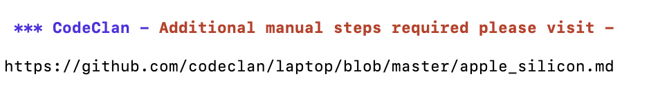

# CodeClan Data Course Laptop Setup

A script to set up a laptop for the CodeClan Data Analysis Course.

## Requirements

There are versions of this script for both MacOS and Windows. Please ensure you have updated your operating system to the most recent version before attempting to run them:

* MacOS Big Sur (11.2)
* Windows 10 (20H2)

Older versions may work but aren't tested.

## Installation - Mac Users

Download and review the script:

```sh
curl --remote-name https://raw.githubusercontent.com/codeclan/data_laptop_script/master/mac
```

Then run it and start the installation:

```sh
sh mac 2>&1 | tee ~/laptop.log
```

You will need to enter your computer password a few times throughout the script to allow installations.

At the end of the installation script, another script will run to check if any applications failed to install (occasionally may claim some application are missing that aren't).

You can repeat this by running the following lines in terminal:

```sh
curl --remote-name https://raw.githubusercontent.com/codeclan/data_laptop_script/master/laptop_install_test
sh laptop_install_test
```

---
> Please follow instructions at the provided [link](apple_silicon.md) if you see -




(**NOTE** - You will need to run the script again)

---

## Installation - Windows Users

Open the start menu by clicking the start button or pressing the `windows` key, then type "powershell" into the search box. Select the "Run as Administrator" option and click "yes" in the popup.


Copy the following lines into the window which opens:

```sh
cd ~\Downloads ;
Set-ExecutionPolicy Bypass -Scope Process -Force ;
Invoke-WebRequest -Uri 'https://raw.githubusercontent.com/codeclan/data_laptop_script/master/windows.ps1' -OutFile '.\codeclan_script' ;
.\codeclan_script
```

This will navigate to your `Downloads` folder, temporarily allow Powershell to run external scripts, then download and run this script.

[The Github Desktop application may open after it has been installed, but can be safely closed once the installer has finished.]

At the end of the installation script, another script will run to check if any applications failed to install. You can repeat this by running the following lines in terminal:

```sh
# This line will re-download the script - ensure you download it to the same folder as the setup script
Invoke-WebRequest -Uri https://raw.githubusercontent.com/codeclan/data_laptop_script/master/laptop_install_test -OutFile '.\codeclan_installation_test.ps1'
# This line will re-run it. You can skip to this step if the script is already downloaded
.\codeclan_installation_test
```

Note that the second script **will not run** without first running the setup script.

## About CodeClan

CodeClan is Scotland’s first and only accredited digital skills academy. Established in 2015, we’re here to bridge the digital skills gap in Scotland. With campuses in Glasgow, Edinburgh and Inverness, we provide a route into exciting careers and a pipeline of digital talent for employers. We run immersive courses in Professional Software Development, Data Analysis and Full-Stack Web Development and a number of upskilling courses in transformative skillsets like UX, Agile, R Programming and Python.

See [our website](https://codeclan.com) for more information.


