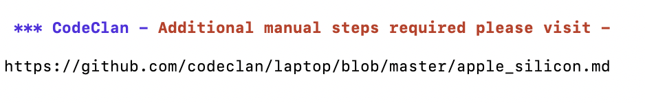
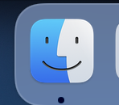
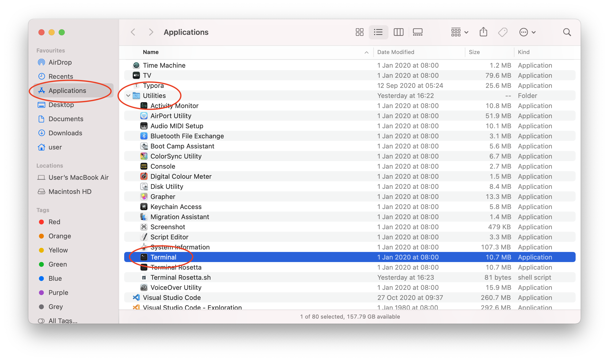
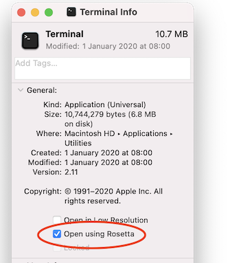

# Apple Silicon Macs

You should be here because you got the following message -

---



---

Congratulations! You have a brand new Apple Silicon based Mac. You're at the bleeding-edge of Mac developments. But it means we have to configure your Terminal to make sure things still work on the course. Please follow these steps -

- Please switch to **Terminal** (you should see **"Terminal"** in the top left of the screen)

- Quit **Terminal** by holding command **(&#8984;)** and pressing **Q**. Or choose **Terminal**  > **Quit Terminal** from the menu at the top of the screen.

- Click on **Finder** in the Dock

  

- Navigate to **Applications** > **Utilities**...

- And click once on **Terminal**



- Hold command **(&#8984;)** and press **I** (for **I**nfo) or choose **File** > **Get Info** from the menu at the top of the screen. Put a tick in the **"Open using Rosetta"** checkbox.



- Close the **Terminal Info** window with the red dot in the top left corner.

- Open **Terminal** again  

- Type `arch` and hit **Enter**. You should see - `i386` or `x86_64`

- (If you don't - check the tick is in **"Open using Rosetta"** when you **Get Info** on the **Terminal**)  

- **IMPORTANT:** You must now run the script again and can refer back to the [original Page](https://github.com/codeclan/laptop)

```sh mac 2>&1 | tee ~/laptop.log```


---

## FAQs

### Wait, what did I just do?

Because your Mac is so new not all the software we use is designed to run on it out of the box. We need to run it using **Rosetta**, a tool that translates older software to run on your Mac. When you first ran the script **Rosetta** was installed. Checking the box forced it to be used for the **Terminal**.

### Are there any downsides?

Over time software will be updated to fully support your Mac. This software should run faster. And so there may be a time when you will no longer want to run your **Terminal** using **Rosetta**.

Most of the software we install uses a tool called `brew`. The status of its support for Apple Silicon Macs can be found here -

https://github.com/Homebrew/brew/issues/7857

---


[Back to original Page](https://github.com/codeclan/laptop)


